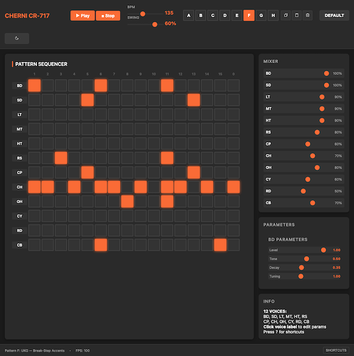

# tr808ish



A simple drum sequencer created with AI in about half an hour, inspired by the classic TR-808 but not pretending to replicate the original. Use it freely in your projects!

This project demonstrates the SDD (Spec-Driven Development) approach - a methodology for rapid development using AI agents with structured prompts and templates. For more details on SDD, check out [SDDRush](https://github.com/chernistry/SDDRush).

All prompts used in this project are available in both locations - the SDDRush repo and the sdd directory within this project.

## Features

- 12 synthesized drum voices (BD, SD, LT, MT, HT, RS, CP, CH, OH, CY, RD, CB)
- 16-step sequencer grid for each voice
- Default atmospheric UK garage pattern
- Adjustable tempo (60-240 BPM)
- Pattern saving/loading via browser storage
- Visual step highlighting during playback
- Theme toggle (light/dark mode)
- On-screen mixer controls
- Keyboard shortcuts support

## How to Use

```bash
# Install dependencies
npm install

# Start development server
npm run dev

# Build for production
npm run build
```

Keyboard shortcuts:
- Space: Play/Stop
- +/-: Increase/Decrease BPM by 5
- T: Toggle theme (light/dark)
- D: Load default pattern
- ?: Show help
- Escape: Close help

## Tech Stack

- TypeScript
- Web Audio API
- Vite
- Tests: Vitest + Playwright

## License

MIT
